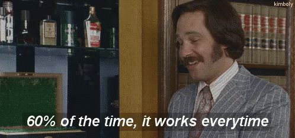
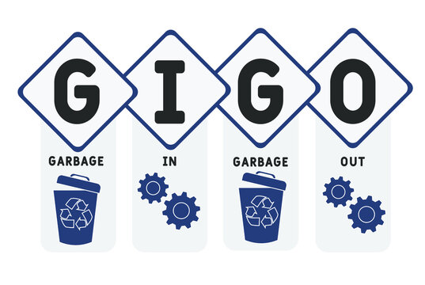

Deep learning algorithms like Convolutional Neural Networks are dominating computer vision tasks. They work extremly well use cases including face detection, age estimation, object detection, object classification, motion detection, pose estimation, and virtually every visually identifiable pattern of interest. Some researchers have even proposed using deep learning algorithms to automate blood spatter analysis [1-2]. However, these neural nets don't always work the way we want them to. Even though CNNs have proved themselves to be better at recognising patterns like camera lens noise [3]. Training these neural netwowrks to be accurate is no joke. Lack of dataset can lead to drastic results.

## Problem Statement
Detecting hidden patterns in images to:

- Identify camera make/model
- Extract EXIF information
- Detect doctored images
- Authenticate document scans
- Detect document forgery

This information requires complex analysis that cannot always be detected by the naked eye. The problem here is to detect _hidden_ patterns within images.

## Possible Solution
Create a dataset with thousands of images. Train your neural network and let it figure out how to classify them. Easy enough right? Well.......maybe

## Does it Work?
Well.............kinda. Yea, sure. Sometimes.

  

  

## Why doesn't it always work?
Compression is a great way to preserve quality of visual elements while optimising storage space. But many times, this same compression can lead to crucial data loss. This is the exact kind of data that we need to perform multimedia forensics tasks. This effect is even worse when lossy compression algorithms like JPEG are applied to pictures. Things become difficult when a picture is moved around multiple times through social media channels, screenshots, direct messages, and instant messaging applications. These apps are optimising for bandwith use and storage space.

Some more targetted problem statements are following.

### JPEG Grid Misalignment
A lot of times when pictures are edited or when they are simply uploaded to social media platforms or any other portals these pictures are cropped. Most of the time, we don't really worry about JPEG grid alignment as long as all the visual elements play nice for us. And this leads to a changes in pictures that do not respect 8x8 JPEG pixel grid. While it doesn't affect visual elements much, it really confuses all the neural networks that are trained on JPEG images or worse, uncompressed images. Which brings us to another point.

### Compression
Simply running CNNs for automating multimedia forensics tasks doesn't work because there's a lot of difference between compressed images and uncompressed images. A neural network must be trained with all the types of images for it to be useful. However, creating such a vast and accurate dataset is another complexity in itself.

### Quality Factor of JPEG Compression
When we collect images from the internet we encounter these images that have travelled through a bunch of websites. This travel can degrade quality of pictures which decreases the accuracy of our neural networks even further. To a point where accurate multimedia forensics becomes almost impossible with deep learning methods.

## Conclusion
Convolutional Neural Networks are not as robust as you might think. They can be extremly delicate, so our input dataset must be carefully vetted before we train them for our next computer vision or multimedia forensics task. If we train our CNNs with uncompressed images then they fail with compressed images. If we train them with compressed images then they fail with randomly cropped or multi-compressed images.
  

  

While CNNs are delicate little flowers while we are automating multi-media forensics. Changes like image compression and mis-aligned JPEG grids hardly ever affect them when they are trained for computer vision tasks. Provided that image quality either remains decent or it's resolution is improved using some GAN. For more details please go through the attached research papers in references below ^.^

PS: Please do **not** confuse challenges discussed in this article with adverserial patch attacks on CNNs. They are a whole another area of research.

## References
1. [Automatic Classification of Bloodstains with Deep Learning Methods](https://link.springer.com/article/10.1007/s13218-022-00760-y)
2. [HemoVision: An automated and virtual approach to bloodstain pattern analysis](https://pubmed.ncbi.nlm.nih.gov/25911495/)
3. [Automatic Source Camera Identification Technique Based-on Hierarchy Clustering Method](https://link.springer.com/chapter/10.1007/978-3-030-78612-0_58)
4. [Training CNNs in Presence of JPEG Compression: Multimedia Forensics vs Computer Vision](https://ieeexplore.ieee.org/abstract/document/9360903)